# Yag Project

חנות אונליין מבוססת React + Node, עם ממשק משתמש בעברית וניהול מוצרים למנהל.

## מה כולל הפרויקט
- דף הבית של החנות
- חיפוש מוצר
- קטגוריות
- דף מוצר בודד
- סל קניות
- כניסה / הרשמה
- דף ניהול מוצרים למנהל
- אימות JWT ונתונים ב־MongoDB

## תיעוד חזותי
הנכסים קיימים ב־`client/docs/`:
- תמונות: `client/docs/images/`
- סרטון הדגמה: `client/docs/videw.mp4`

### צילומי מסך
#### בית
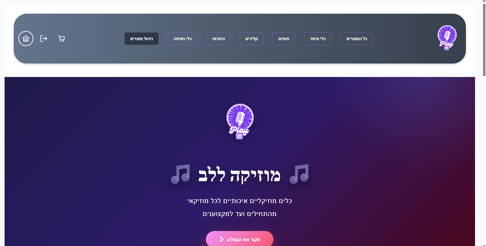
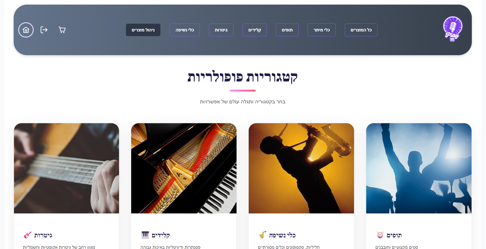

#### חיפוש וקטגוריות
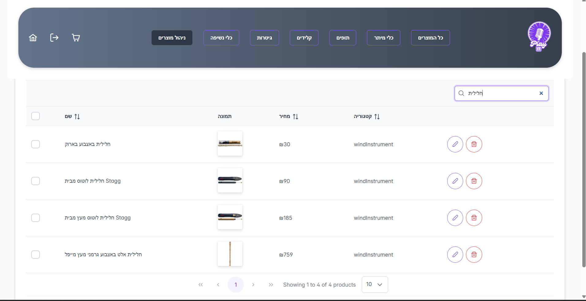
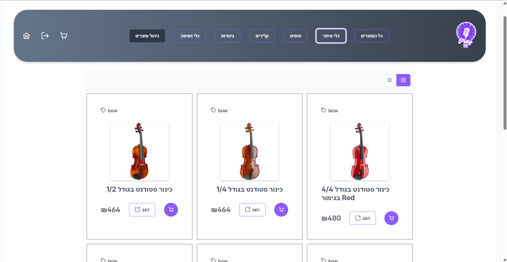

#### כניסה ורישום
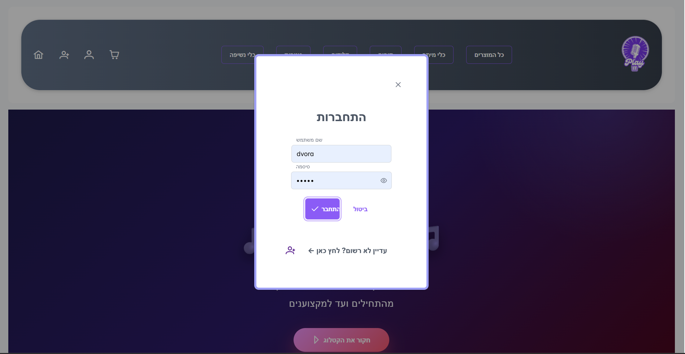
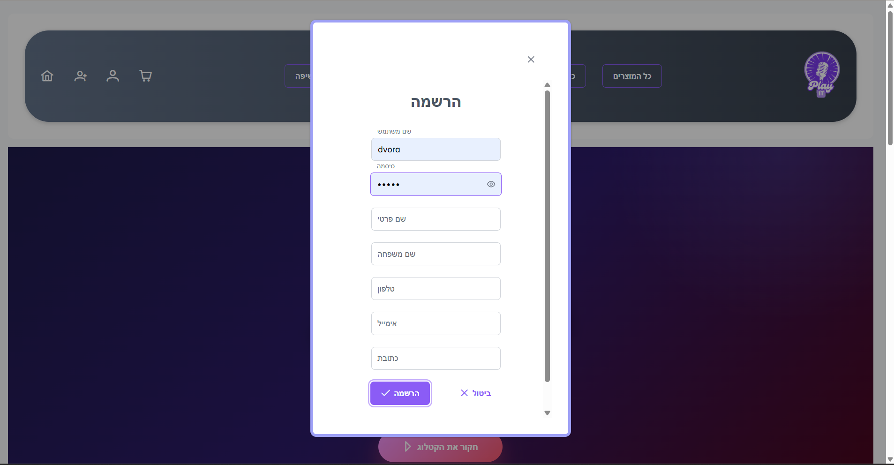

#### סל קניות
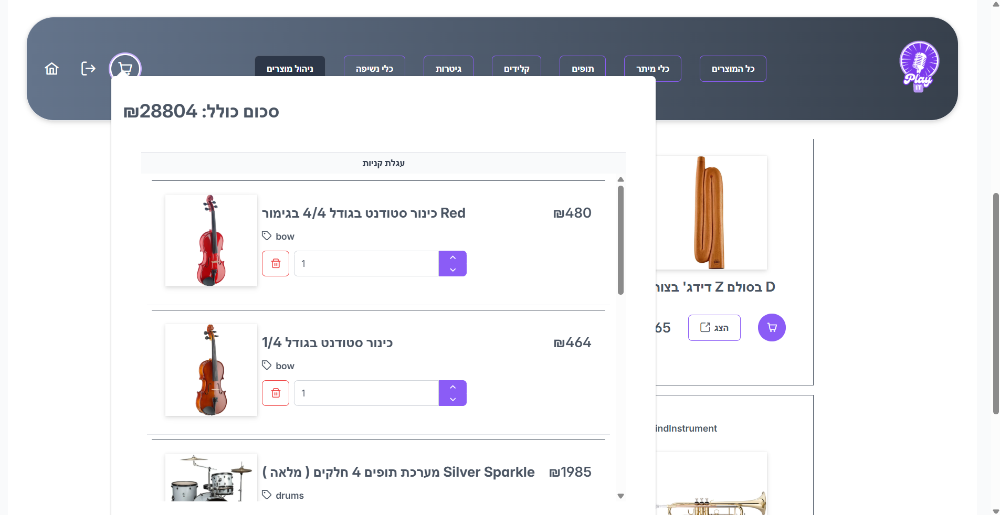
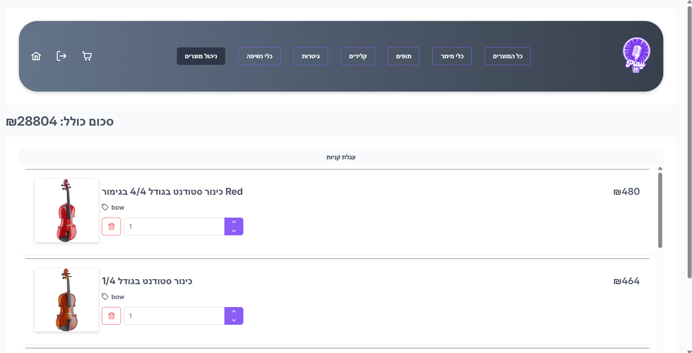

#### ניהול מוצרים ומוצר בודד
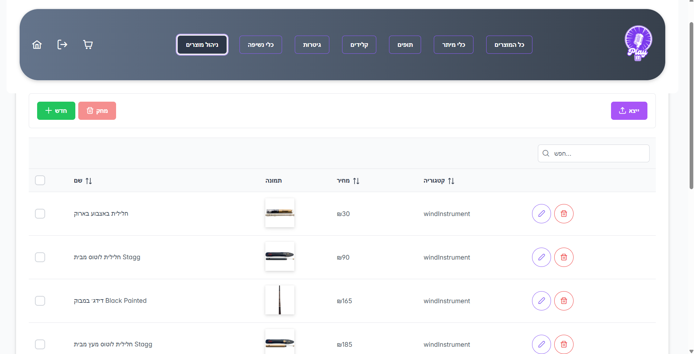
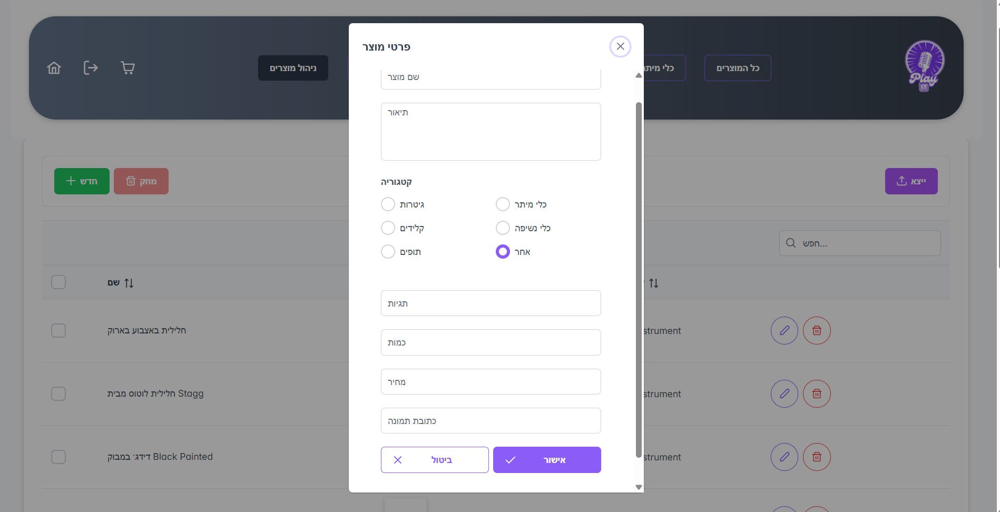
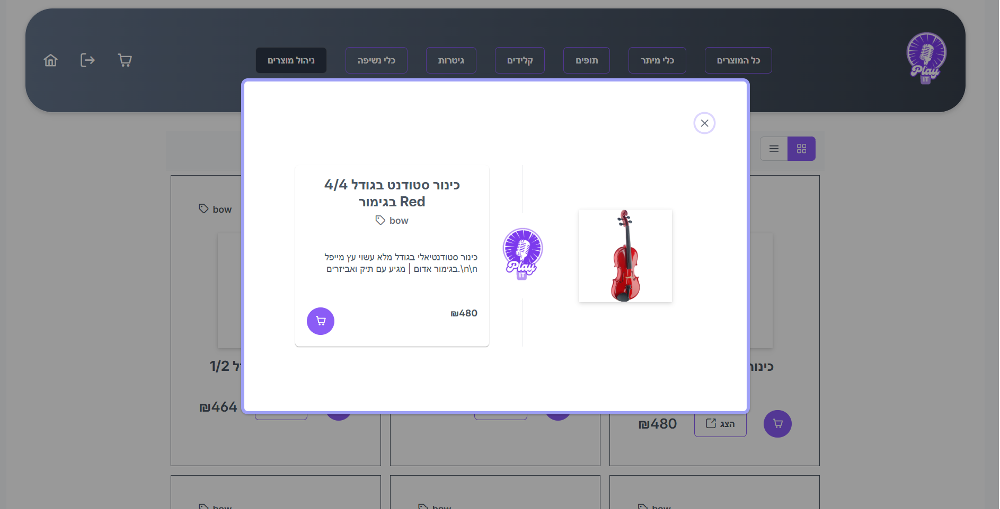

### סרטון הדגמה
[צפייה בסרטון ההדגמה](client/docs/videw.mp4)

## התקנה והרצה
```bash
cd client
npm install
npm start
```

היישום יפעל ב־`http://localhost:3000`.

## מבנה הפרויקט
- `client/` — קוד הלקוח
  - `client/src/` — קוד React
  - `client/src/components/` — רכיבים מרכזיים
  - `client/public/` — קבצים סטטיים של הלקוח
  - `client/docs/` — תמונות וסרטון תיעוד
- `server/` — קוד השרת

## עקרונות תמיכה ושיפור
- התמונות ב־`client/docs/images/` מיועדות ל־README ותיעוד בלבד.
- אם תרצי להשתמש בתמונות בתוך האפליקציה, עדיף לשים אותן ב־`client/public/images/`.
- הנתיבים ב־React נשארו באנגלית, אך הממשק מוצג בעברית.

## הערה חשובה
אני גם מעדכן את Git כדי לתמוך בתמונות האלה: `client/docs/` יתווסף למעקב.
